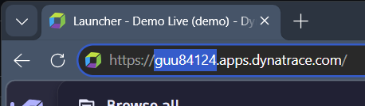

# dt-mcp-server

**This is a modified and extended version of the [dynatrace-for-ai](https://github.com/Dynatrace/dynatrace-for-ai) project**, with added MCP server integration, per-app smart reconciliation, Live State Conflict Protection, Windows-first documentation, and non-technical accessibility improvements.

**ELI5:** You are setting up an AI assistant that can answer questions about your Dynatrace environment in plain English. Type a question → get a real answer from live production data.

An AI-powered observability workspace for Dynatrace — combining GitHub Copilot or Claude AI, the Dynatrace MCP server, and the dynatrace-for-ai skills framework to accelerate incident triage, root cause analysis, and day-to-day observability workflows.

> **What this gives you:** Ask AI natural language questions about your Dynatrace environment and get accurate, production-aware answers — powered by verified domain knowledge, live API access, and pre-built investigation workflows.

---

## This is an MCP repo (and `dtctl` is a separate one)

To be unambiguous: **this repository is an MCP workspace.** It configures the [Dynatrace MCP server](https://github.com/dynatrace-oss/dynatrace-mcp) so an AI assistant (Copilot, Claude) can talk to your Dynatrace tenant in-process, and it ships skills, prompts, and conventions on top of that.

**`dtctl` is a completely different project, in a completely different repository, owned and released independently:** [github.com/dynatrace-oss/dtctl](https://github.com/dynatrace-oss/dtctl). It's a kubectl-style CLI for Dynatrace. Nothing in this repo builds, ships, or vendors it.

That said, **this workspace is configured assuming you have `dtctl` installed alongside MCP**, and the agent prompts/skills are written to use the best of both:

- **MCP** is preferred for things it does best (Davis CoPilot chat, Davis Analyzers, ad-hoc Slack/email, `send_event`, NL→DQL helpers, structured-JSON-direct-to-the-AI).
- **`dtctl`** is preferred for things *it* does best (declarative `apply`/`diff`/`history`/`restore`, `share`/`unshare`, persistent multi-context with safety levels, custom output formats, anything you want to *see* in the terminal).
- For the large overlap (DQL queries, reading entities, creating/editing notebooks/dashboards/workflows/settings), either one works — the AI follows a small selection rubric documented in [CONVENTIONS.md](CONVENTIONS.md#tool-selection-mcp-vs-dtctl) and continuity rules.

You can run this workspace **MCP-only** if you skip Step 3 — most things still work, but you'll lose the `dtctl`-only column from the [capability table](#two-paths-to-dynatrace) below. The full experience expects both.

---

## What's Inside

```
dt-mcp-server/
├── README.md                     # Setup guide and quick reference
├── CHANGELOG.md                  # Workspace release notes (this repo only — see file for dtctl history link)
├── ARCHITECTURE.md               # How the workspace is built and how components connect
├── CONVENTIONS.md                # Single source of truth for all agent rules (Tool Selection rubric, reconciliation, DQL, Sync Checklist)
├── CHEATSHEET.md                 # Quick reference — copy-paste DQL queries and critical rules
├── CLAUDE.md                     # Auto-loaded session briefing for Claude Code
├── LICENSE
├── skills-lock.json              # Locked skill versions
├── .gitignore
├── .github/
│   ├── copilot-instructions.md   # Auto-loaded session briefing for GitHub Copilot
│   └── prompts/                  # 7 investigation workflows
│       ├── health-check.prompt.md
│       ├── daily-standup.prompt.md
│       ├── daily-standup-notebook.prompt.md
│       ├── investigate-error.prompt.md
│       ├── troubleshoot-problem.prompt.md
│       ├── incident-response.prompt.md
│       └── performance-regression.prompt.md
├── .agents/skills/               # 17 domain skills (Dynatrace observability + dtctl + workflow helpers)
├── .claude/skills/               # Symlinks for Claude Code compatibility
├── .mcp.json                     # MCP server entries (CLI / Claude Code)
├── .vscode/
│   └── mcp.json                  # MCP server entries (VS Code + GitHub Copilot)
├── scripts/                      # Validation helpers (validate-tenant-write.ps1 runs before any tenant write — MCP or dtctl)
├── completions/                  # dtctl shell completions (bash, fish, zsh)
├── docs/
│   └── images/                   # README screenshots (e.g. tenant-id-location.png)
├── demos/                        # Demo scripts (e.g. ai-observability-demo.md)
└── temp_dtctl_files/             # Local-only tenant experiments + nickname registry (gitignored, never pushed)
```

| What | Why | Get It |
|---|---|---|
| [VS Code](https://code.visualstudio.com/) | Where you will work with the AI | Download from code.visualstudio.com |
| GitHub Copilot or Claude Code | The AI brain | Copilot: github.com/features/copilot (subscription) · Claude: claude.ai/code |
| [Node.js](https://nodejs.org/) v18+ | Powers the skill installer and MCP server | Download LTS version |
| [dtctl](https://github.com/dynatrace-oss/dtctl) | Optional companion CLI — recommended for the full experience (see *Two paths to Dynatrace* table below) | See Step 3 below |
| A Dynatrace environment | Live data source | Any `*.apps.dynatrace.com` tenant you have access to |

---

## Setup

> **Dynatrace employees & partners:** This workspace is pre-configured for the standard
> Dynatrace demo environment (`guu84124.apps.dynatrace.com`). No changes are
> required to run demos against the production demo tenant. Clone the repo,
> reload VS Code, and authenticate via your Dynatrace SSO when prompted.

### Choose Your Frontend

This workspace works with:
- **GitHub Copilot** in VS Code (requires subscription)
- **Claude Code** via web or desktop (requires Claude Pro or Team)

Select your setup path below. Both receive the same skills, prompts, and MCP server access.

**GitHub Copilot Path** → Follow Steps 1–6 below. Copilot loads `.github/copilot-instructions.md` automatically.

**Claude Code Path** → Follow Steps 1–5, then open `CLAUDE.md` in your Claude Code session. Claude loads `.claude/skills/` symlinks automatically.

### Recommended VS Code Extensions (GitHub Copilot users)

This workspace assumes **VS Code + GitHub Copilot**. Install these extensions from the VS Code marketplace before setup:

| Extension | Why |
|---|---|
| **GitHub Copilot Chat** | Main AI assistant for the workspace |
| **Dynatrace Apps** | Strato app development and dashboard component support |
| **Dynatrace Debugging Extension** | Debugging and testing in Dynatrace |
| **PowerShell** | Enables validation scripts (validate-tenant-write.ps1, refresh-context.ps1) |
| **GitLens** | Git history, blame, branch management — helpful for collaboration |

> **Claude Code users:** No extension installation needed — Claude Code runs in the web browser or desktop app.

### 1. Clone this workspace

Clone my repo (`dt-mcp-server`):

```bash
git clone https://github.com/israel-salgado/dt-mcp-server.git
cd <your-chosen-path>/dt-mcp-server
```

Replace `<your-chosen-path>` with wherever you cloned it (e.g. `C:\github\dt-mcp-server` on Windows or `~/code/dt-mcp-server` on macOS/Linux). The folder name stays `dt-mcp-server` unless you renamed it during clone.

Then open the folder in VS Code via **File → Open Folder**.

### 2. Update skills to latest

```bash
npx skills add dynatrace/dynatrace-for-ai
npx skills add dynatrace-oss/dtctl
```

> Run this command any time Dynatrace releases new skills.

### 3. Install `dtctl` (separate repo)

`dtctl` is a sibling project, **not** part of this repo. It's a kubectl-style CLI for Dynatrace that the AI uses to run DQL queries, manage workflows, and verify the notebooks/dashboards it creates.

Follow the install + authentication instructions in the official dtctl repo:

**→ [github.com/dynatrace-oss/dtctl](https://github.com/dynatrace-oss/dtctl)**

> **Note:** I also maintain a fork at **[github.com/israel-salgado/dtctl](https://github.com/israel-salgado/dtctl)** that I'm gradually updating to be more beginner-friendly (clearer install steps, plain-English docs, Windows-first examples). Check there if the upstream README feels too dense — otherwise the official repo above is the canonical source.

Once installed, return here and continue with Step 4. A working `dtctl --version` and an authenticated context (verified with `dtctl auth whoami --plain`) is the only thing this workspace needs from it.

#### Two paths to Dynatrace

The AI can reach Dynatrace **two independent ways**. Both can do most of the same work today; you can use either, both, or switch between them at any time.

| | **`dtctl`** | **MCP** |
|---|---|---|
| **What it is** | A CLI the AI runs in your terminal | A direct API bridge the AI calls in-process |
| **Configured in** | Step 3 (install + auth) | Step 4 (`mcp.json` files) |
| **Visible to you** | Yes — commands appear in the integrated terminal | No — runs silently |
| **Run DQL queries** | ✅ | ✅ |
| **Read entities (services, hosts, problems, vulnerabilities)** | ✅ | ✅ |
| **Create/edit notebooks, dashboards, workflows, settings** | ✅ | ✅ |
| **Davis CoPilot chat** | ✅ (`dtctl exec copilot`) | ✅ (`chat_with_davis_copilot`) |
| **Davis Analyzers (forecasting, anomaly detection)** | ✅ (`dtctl exec analyzer`) | ✅ (`execute_davis_analyzer`) |
| **Switch tenants from chat** | *"switch to `<nickname>`"* (uses your registry) | *"use the `<nickname>` server, …"* (uses MCP server name) |
| **Declarative apply / diff / history / restore** | ✅ | — |
| **Document sharing (`share` / `unshare`)** | ✅ | — |
| **Persistent multi-context config + safety levels** | ✅ | — (one tenant per server entry) |
| **Multiple output formats (json / yaml / csv / toon / table / wide)** | ✅ | — (always JSON) |
| **AI skills installer (`dtctl skills install`)** | ✅ | — |
| **Send ad-hoc Slack message from chat** | — | ✅ |
| **Send ad-hoc email from chat** | — | ✅ |
| **Ingest a custom event (`send_event`)** | — | ✅ |
| **Reset Grail query budget** | — | ✅ |
| **Natural-language → DQL helpers (one-shot)** | — | ✅ |

**Bottom line:** Both are first-class. Configure whichever you'll use; configure both if you want every capability available at all times.

### 4. Configure additional tenants for MCP (optional)

> **Just want to query the public demo tenant?** Skip this entire section and go to Step 5 — the workspace already works against `demo.live` out of the box.
>
> **Want the AI to talk to your own Dynatrace tenant via MCP?** Keep going. (For the full capability comparison between MCP and `dtctl`, see the table just above.)

The workspace is pre-configured with two MCP server entries: the shared
demo tenant (`demo.live` → `guu84124`, public) and a `NICKNAME`
placeholder you can rename to your own tenant.

Complete sub-steps **4.A–4.C** to add your tenant. Step **4.D** is optional cosmetic polish — skip it if you don't care about the AI's session-start banner mentioning your tenant by name.

#### Tenant Configuration Checklist

**Step 4.A — Update `.vscode/mcp.json`**

You'll edit two things in the JSON below: `NICKNAME` and `TENANTID`.

- **`TENANTID`** is the 8-character code at the start of your Dynatrace URL. Example: for `https://abc12345.apps.dynatrace.com`, your tenant ID is `abc12345`.

  > _**Where to find it:** open Dynatrace in your browser and look at the address bar. The first 8 characters of the hostname are your tenant ID._
  >
  > __

- **`NICKNAME`** is any short label you'll remember. You'll say it in chat — *"use the **prod-east** server, list services"*. Pick anything: `prod-east`, `sandbox`, `liit`, etc.
- **The URL ending** depends on which kind of tenant you have:
  - If your Dynatrace URL ends in `.apps.dynatrace.com` → use that (this is what almost everyone has).
  - If it ends in `.sprint.apps.dynatracelabs.com` → use that (internal Dynatrace lab tenants only).
  - When in doubt, use the first one.

```json
{
  "servers": {
    "demo.live": {
      "type": "stdio",
      "command": "npx",
      "args": ["-y", "@dynatrace-oss/dynatrace-mcp-server@latest", "--stdio"],
      "env": {
        "DT_ENVIRONMENT": "https://guu84124.apps.dynatrace.com"
      }
    },
    "NICKNAME": {
      "type": "stdio",
      "command": "npx",
      "args": ["-y", "@dynatrace-oss/dynatrace-mcp-server@latest", "--stdio"],
      "env": {
        "DT_ENVIRONMENT": "https://TENANTID.apps.dynatrace.com"
      }
    }
  }
}
```

**Step 4.B — Mirror the change to `.mcp.json`**

This workspace ships **two** MCP config files that must stay in sync:

| File | Read by |
|---|---|
| `.vscode/mcp.json` | VS Code (GitHub Copilot Chat) |
| `.mcp.json` (workspace root) | Claude Code, Cursor, Copilot CLI, other MCP clients |

They contain the same servers — only the top-level key name differs (`servers` in the VS Code file, `mcpServers` in the root file).

**Easiest way: just ask the AI.** In Copilot Chat (or Claude Code), paste:

> *"I added a new tenant to `.vscode/mcp.json`. Mirror it into `.mcp.json` and confirm both files match."*

The AI will copy the new entry across, fix the top-level key, and verify the two files are in sync.

**Prefer to do it by hand?** Open both files in VS Code side-by-side and copy the new entry across. The only thing to watch for is the top-level key — `servers` in `.vscode/mcp.json`, `mcpServers` in `.mcp.json`.

**Why this matters:** if the two files drift, VS Code and Claude Code will see different lists of tenants, and you'll get confusing *"unknown server"* errors when switching tools.

**Step 4.C — Register the same nickname for `dtctl` shortcuts**

Pick the **same nickname** you used in 4.A (e.g. `YOURNICKNAME`, `prod-east`, `sandbox`) and add it to the local nickname registry at `temp_dtctl_files/tenant-memory/tenants.json`. This is what makes *"switch to `<nickname>`"* work in chat — the AI uses this file to translate your short name into the full `dtctl` context the AI then activates.

Using the same nickname in both places (MCP server name + dtctl registry) means you only ever have to remember one word per tenant.

**Easiest way: just ask the AI.** In Copilot Chat or Claude Code, paste (replacing the values with yours):

> *"Add my tenant to the nickname registry at `temp_dtctl_files/tenant-memory/tenants.json`. Nickname: `YOURNICKNAME`. Tenant ID: `abc12345`. URL: `https://abc12345.apps.dynatrace.com`. Class: `prod`. Safety: `readwrite-mine`."*

**Prefer to do it by hand?** Open `temp_dtctl_files/tenant-memory/tenants.json` and add an entry inside the `"tenants"` array:

```json
{
  "nickname": "YOURNICKNAME",
  "id": "abc12345",
  "url": "https://abc12345.apps.dynatrace.com",
  "class": "prod",
  "safety": "readwrite-mine",
  "notes": "Personal tenant."
}
```

Field values:
- `nickname` — same as your MCP server name from 4.A.
- `id` / `url` — same tenant ID and URL from 4.A.
- `class` — `prod` or `sprint`.
- `safety` — controls what the AI is allowed to do in this tenant. Pick one:
  - `readonly` — query only; cannot create, update, or delete anything.
  - `readwrite-mine` *(recommended)* — read everything; create/update/delete only resources you own (your notebooks, dashboards, workflows).
  - `readwrite-all` — read everything; create/update/delete any resource in the tenant.
  - `dangerously-unrestricted` — everything in `readwrite-all` plus permanent deletes (e.g. emptying trash). Use only when you really mean it.

> **Note:** The registry file lives in `temp_dtctl_files/` and is intentionally git-ignored — your tenant entries stay local and never get pushed.

**Step 4.D — Update the briefing tables (optional, cosmetic)**

If you want the AI's session-start summary to mention your tenant by name (rather than only `demo.live`), ask the AI to add a one-line row to the Environment table in `.github/copilot-instructions.md` and `CLAUDE.md`:

> *"Add a row for my tenant `<your-nickname>` to the Environment table in `.github/copilot-instructions.md` and `CLAUDE.md`."*

Skip this if you don't care about the session-start banner — everything else works without it.

> **Note on `dtctl` authentication:** You already configured `dtctl` in [Step 3](#3-install-dtctl-separate-repo). MCP and `dtctl` are independent authentication paths — nothing more to do here.

#### How you'll know Step 4 worked

After you finish 4.A–4.C and reload VS Code (Step 5), the verify command in [Step 6](#6-verify-the-connection) using your nickname should return real services from your tenant. If it does — you're done.

### 5. Reload VS Code

Press `Ctrl+Shift+P` (Windows / Linux) or `Cmd+Shift+P` (Mac) → `Developer: Reload Window`

When you first use a prompt in Copilot Chat, a browser window will open for
Dynatrace SSO authentication. This is expected — complete the login and return
to VS Code. Subsequent sessions authenticate automatically.

### 6. Verify the connection

**Quick test against the public demo tenant** — in Copilot Chat (or Claude Code), type:

```
Using the demo.live server, list the top 5 services by request volume in the last hour
```

**If you completed Step 4 with your own tenant**, try the same query against your nickname:

```
Using the <your-nickname> server, list the top 5 services by request volume in the last hour
```

(For example: *"Using the **prod-east** server, list the top 5 services…"*)

If you see a table of services with request counts — you are live and ready to demo.

## What Just Happened?

| Piece | What It Does | Analogy |
|---|---|---|
| Skills | Domain knowledge about Dynatrace | A textbook the AI reads before answering |
| `dtctl` | One way the AI reaches Dynatrace — by running CLI commands in your terminal | A keyboard the AI uses to type at a console |
| MCP server | The other way the AI reaches Dynatrace — a direct API bridge it calls in-process | A direct phone line to the platform |
| Prompts | Pre-built investigation workflows | Recipes you follow step by step |

## Your First Commands

**Verify your tenant connection (terminal):**

```bash
dtctl config current-context        # which tenant am I pointed at?
dtctl auth whoami --plain           # am I authenticated?
dtctl doctor                        # full health check of CLI + auth
```

If `whoami` returns `User session is no longer active` or `invalid_grant`, run `dtctl auth login` to refresh the session, then re-run the commands above.

**Verify Copilot + MCP (Copilot Chat):**

```
Use the demo.live server for all queries in this session
List the top 5 services by request volume in the last hour
```

**Then try a workflow prompt:**

| Type This | What It Does |
|---|---|
| `/health-check` | Is my service healthy right now? |
| `/incident-response` | What is currently broken in production? |
| `/daily-standup` | Give me a morning report across all services |

---

## Skills

Skills are domain knowledge files that teach Copilot how Dynatrace works — correct DQL syntax, field names, query patterns, and investigation workflows. They load automatically when relevant.

| Skill | What It Covers |
|---|---|
| `dt-dql-essentials` | DQL syntax, common pitfalls, query patterns — **load before any DQL** |
| `dt-obs-problems` | Davis Problems, root cause analysis, impact assessment |
| `dt-obs-logs` | Log queries, filtering, pattern analysis, error classification |
| `dt-obs-tracing` | Distributed traces, spans, failure detection, log correlation |
| `dt-obs-services` | RED metrics, SLA tracking, runtime-specific monitoring (Java, .NET, Node.js, Python, PHP, Go) |
| `dt-obs-hosts` | Host and process metrics, CPU, memory, disk, containers |
| `dt-obs-kubernetes` | Pods, workloads, nodes, labels, ingress, PVCs |
| `dt-obs-aws` | EC2, RDS, Lambda, ECS/EKS, VPC, cost optimization |
| `dt-obs-frontends` | RUM, Web Vitals, user sessions, mobile crashes |
| `dt-app-dashboards` | Dashboard JSON creation and modification |
| `dt-app-notebooks` | Notebook creation and analytics workflows |
| `dt-migration` | Classic entity DQL → Smartscape migration |
| `dtctl` | CLI commands for managing Dynatrace resources from the terminal |

---

## Prompts

Prompts are pre-built investigation workflows available as slash commands.

- **GitHub Copilot:** Type `/` in Copilot Chat (see `.github/prompts/`)
- **Claude Code:** Type `/` in Claude chat or paste prompt content from `.github/prompts/`

| Prompt | When to Use |
|---|---|
| `/health-check` | Routine service health — performance, problems, deployments, vulnerabilities |
| `/daily-standup` | Morning team report across multiple services with today vs yesterday comparison |
| `/daily-standup-notebook` | Standup report + Dynatrace notebook creation + dtctl verification |
| `/investigate-error` | "Something is wrong with this service" — error-focused investigation |
| `/troubleshoot-problem` | Deep 7-step investigation into a specific Dynatrace problem |
| `/incident-response` | Full production incident triage — all active problems, prioritized by business impact |
| `/performance-regression` | Did my deployment cause a slowdown? Before vs after comparison with trace analysis |

### Investigation Workflow

The prompts follow a structured drill-down pattern:

```
/health-check          →  flag concerns
/troubleshoot-problem  →  investigate a specific problem
/investigate-error     →  drill into error patterns
/incident-response     →  full triage when things are on fire
```

---

## Key Concepts

### Why Skills Matter

Copilot without skills will guess DQL syntax — and get it wrong. For example, it might use `event.status == "OPEN"` (doesn't exist) instead of `event.status == "ACTIVE"`, or `log.level` instead of `loglevel`. The skills encode the corrections for known failure modes before Copilot writes a single query.

### How MCP Works (and when it matters)

This repo is the **MCP server workspace** — its job is to wire an AI
assistant (GitHub Copilot, Claude Code, etc.) into your Dynatrace tenant
via the **Model Context Protocol (MCP)** so the AI can call live Dynatrace
APIs directly.

MCP is one of two independent paths the AI uses to reach Dynatrace. The
other path is **`dtctl`**, a sibling CLI maintained in its own repo:
[github.com/dynatrace-oss/dtctl](https://github.com/dynatrace-oss/dtctl).
Both paths are first-class and largely overlap in capability today — see
[Two paths to Dynatrace](#two-paths-to-dynatrace-read-this-once) above
for a side-by-side capability comparison so you can decide which to
configure (or configure both).

The two paths are completely independent: switching `dtctl` to a different
tenant does **not** redirect MCP traffic, and vice versa.

### MCP Configuration Files

This workspace ships with two MCP configuration files. They contain the same
information but are read by different MCP clients.

| File | Read by | Top-level key |
|---|---|---|
| `.mcp.json` (workspace root) | Claude Code (CLI/desktop), Cursor, Copilot CLI, generic MCP clients | `mcpServers` |
| `.vscode/mcp.json` | VS Code (GitHub Copilot Chat, Claude Code extension) | `servers` |

#### Why these files exist

This repo does **not** ship the MCP server code itself. The actual server is
the upstream Dynatrace package
[`@dynatrace-oss/dynatrace-mcp-server`](https://www.npmjs.com/package/@dynatrace-oss/dynatrace-mcp-server),
published on npm by Dynatrace.

MCP clients (VS Code, Claude Code, Cursor, etc.) need a recipe telling them
*how to start* an MCP server and *which tenant* it should talk to. That recipe
is exactly what `mcp.json` provides:

- **`command: "npx"`** — instructs the client to run the server via `npx`,
  which downloads and executes the upstream package on demand. No global
  install, no separate build step — just Node.js ≥ v18.
- **`args: ["-y", "@dynatrace-oss/dynatrace-mcp-server@latest", "--stdio"]`**
  — tells `npx` which package to run and to communicate over stdio (the
  transport every MCP client supports).
- **`env.DT_ENVIRONMENT`** — the only tenant-specific input; tells the
  spawned server which Dynatrace tenant to authenticate against. The
  server is otherwise tenant-agnostic, so each tenant gets its own entry
  in `mcp.json` with its own `DT_ENVIRONMENT`.

You can think of `mcp.json` as `package.json` for MCP servers: a manifest
the client reads to know what to launch, with what arguments, against
which environment.

#### Why two files?

Two conventions, claimed by two different audiences:

- **Root-level `.mcp.json`** is the editor-agnostic convention used by every
  MCP client *except* VS Code — it lives at the project root next to other
  project metadata (`package.json`, `.gitignore`, etc.).
- **`.vscode/mcp.json`** follows VS Code's long-standing rule that anything
  VS Code-specific lives under `.vscode/` (alongside `settings.json`,
  `launch.json`, `tasks.json`). VS Code's MCP loader is hard-coded to look
  there — it does not read the root `.mcp.json`.

The two files **must be kept in sync**. After editing one, regenerate the
other:

```bash
# Regenerate .mcp.json from .vscode/mcp.json
jq "{mcpServers: .servers}" .vscode/mcp.json > .mcp.json
```

#### How to update them

Each entry is a recipe for the MCP client to **launch a local Node.js MCP
server process pointed at a specific tenant**. The pattern is always the
same:

```jsonc
"<server-nickname>": {
  "type": "stdio",
  "command": "npx",
  "args": ["-y", "@dynatrace-oss/dynatrace-mcp-server@latest", "--stdio"],
  "env": {
    "DT_ENVIRONMENT": "https://<your-tenant-id>.apps.dynatrace.com"
  }
}
```

- **`<server-nickname>`** — the name you say in chat (e.g. *"Use the
  `production-mcp` server, list services"*). Convention is to suffix with
  `-mcp` but anything works. Must be unique within the file.
- **`DT_ENVIRONMENT`** — the tenant URL. For production tenants use
  `.apps.dynatrace.com`; for sprint/lab tenants use
  `.sprint.apps.dynatracelabs.com`.

**Update workflow:**

1. Edit `.vscode/mcp.json` — add or modify a server entry.
2. Run `jq "{mcpServers: .servers}" .vscode/mcp.json > .mcp.json` to mirror
   the change to the root file.
3. Reload VS Code (`Ctrl+Shift+P` → *Developer: Reload Window*) so the new
   MCP server subprocess is spawned with the new config.
4. Verify in Copilot Chat: *"Use the `<server-nickname>` server, list the
   top 5 services by request volume"*.

#### Why `guu84124` is hard-coded but `TENANTID` is a placeholder

The local MCP server is **tenant-agnostic** — it must be told
`DT_ENVIRONMENT` at launch. The MCP client reads that URL from `mcp.json`
and passes it to the spawned process. There is no other discovery
mechanism today.

- **`guu84124`** is the *public* Dynatrace demo tenant
  (`demo.live.dynatrace.com`). It's safe to commit because anyone in the
  world can reach it. A fresh clone of this repo "just works" against it.
- **`TENANTID`** is a placeholder — replace it locally with your own
  tenant ID, but don't commit your private ID into a public repo.

When adding or updating MCP servers, always update both files. Regenerate `.mcp.json` from `.vscode/mcp.json` using:

```bash
jq "{mcpServers: .servers}" .vscode/mcp.json > .mcp.json
```

---

## dtctl CLI (separate repo)

[dtctl](https://github.com/dynatrace-oss/dtctl) is a sibling kubectl-style CLI for Dynatrace, maintained in its own repository. It complements this MCP workspace by giving you (and the AI) terminal-level access to run DQL queries, manage workflows, and verify notebooks.

This README intentionally **does not** duplicate `dtctl` install, auth, or usage docs — those live in the dtctl repo and evolve independently. Refer to:

**→ [github.com/dynatrace-oss/dtctl](https://github.com/dynatrace-oss/dtctl)**

for installation, OAuth and token-based auth, safety levels, context management, and command reference.

> **Side note:** I also maintain a personal fork at
> [github.com/israel-salgado/dtctl](https://github.com/israel-salgado/dtctl)
> with a few experimental edits (mostly README clarifications I plan to upstream). Feel free to peek, but the `dynatrace-oss/dtctl` repo above is the authoritative source and is what the rest of this document references.

---

## Keeping Up to Date

```bash
# Update all skills to latest
npx skills add dynatrace/dynatrace-for-ai
npx skills add dynatrace-oss/dtctl

# Regenerate .mcp.json after any MCP server changes
jq "{mcpServers: .servers}" .vscode/mcp.json > .mcp.json

# Commit the updates
git add .
git commit -m "Update skills to latest"
git push
```

---

## Related Resources

- [ARCHITECTURE.md](./ARCHITECTURE.md) — How the workspace components connect
- [dynatrace-for-ai](https://github.com/Dynatrace/dynatrace-for-ai) — Skills and prompts source repo
- [dtctl](https://github.com/dynatrace-oss/dtctl) — Dynatrace CLI for humans and AI agents
- [Dynatrace MCP Server](https://docs.dynatrace.com/docs/shortlink/dynatrace-mcp-server) — Official MCP server docs
- [Agent Skills spec](https://agentskills.io) — The open standard this workspace follows

---

## License

Skills and prompts sourced from [dynatrace-for-ai](https://github.com/Dynatrace/dynatrace-for-ai) and [dtctl](https://github.com/dynatrace-oss/dtctl) are Apache-2.0 licensed.
